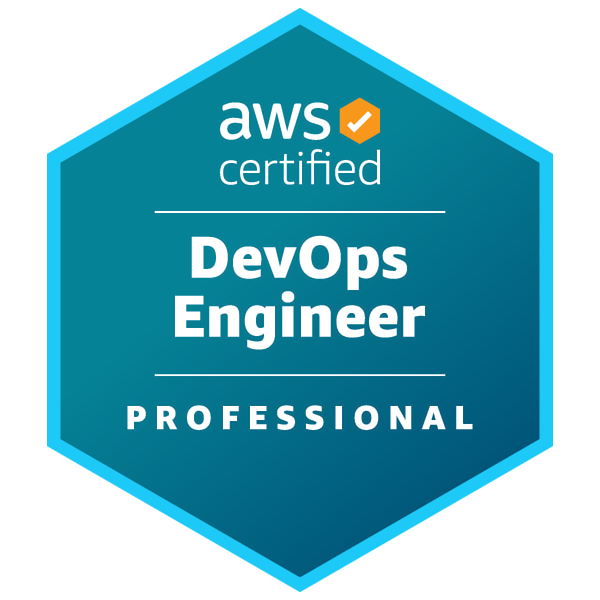

# 안녕하세요 HELLO

이영재입니다.

## 블로그
[https://leeyeongjae1.github.io](https://leeyeongjae1.github.io)

## ROAD TO CANDIDATE MASTER

## Road to 700
[https://openpowerlifting.org/u/yeongjaelee](https://openpowerlifting.org/u/yeongjaelee)

## [Credly](https://www.credly.com/users/yeongjae-lee.e63e4a70/badges)

